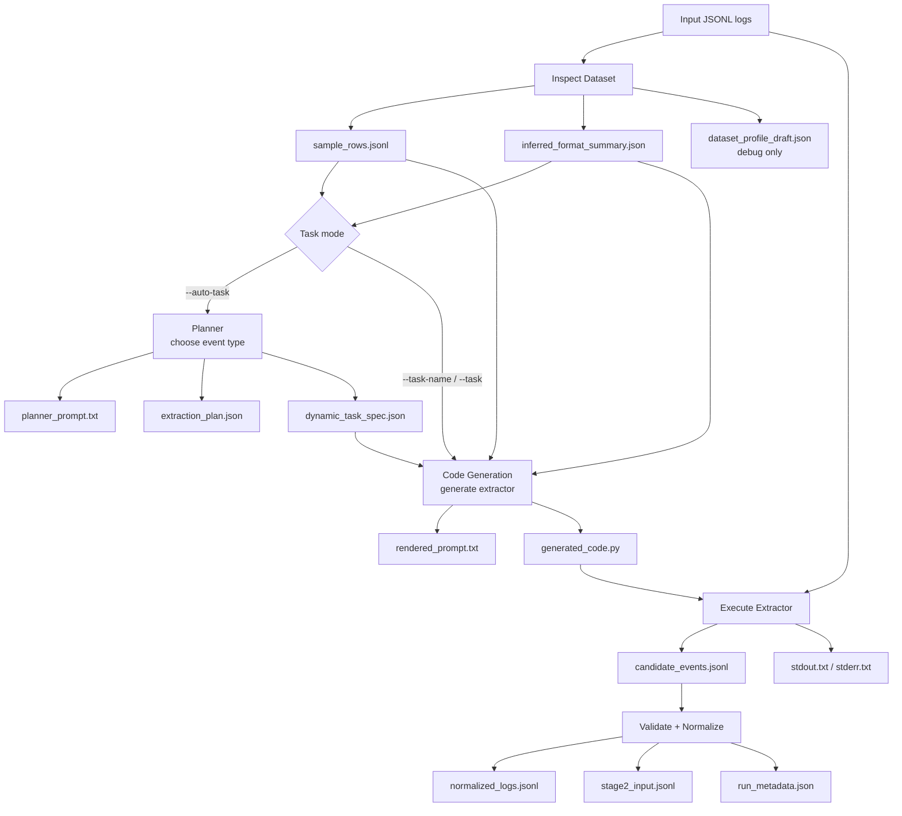

# Stage 1 通用事件抽取

Stage 1 是一個 profile-free 的 security log 事件抽取子系統。它讀取 JSONL
格式的原始 log，根據指定 task 或自動 planner 產生 extractor，輸出可交給
Stage 2 使用的 `stage2_input.jsonl`。

Stage 1 的責任範圍是抽取 timeline-relevant candidate events。事件分群、
timeline reconstruction 和 final report 由 Stage 2 / Stage 3 處理。

## 1. 架構



Stage 1 分成兩個 LLM decision points：

- Planner：判斷這份資料最適合抽什麼事件。
- Code generator：根據 task spec 和 sample rows 產生 extractor code。

Deterministic code 負責 sampling、prompt rendering、JSONL validation、
normalization 和 Stage 2 handoff。Stage 1 不需要手寫 dataset profile，也不應放入
dataset-specific parser。

## 2. 前置需求

Stage 1 可以獨立搬移。只要複製整個 `stage1/` 資料夾到另一個 repo root，就可以
從該位置執行：

```bash
python stage1/scripts/run_stage1.py --help
```

Live Gemini mode 需要：

```text
google-genai
python-dotenv
GEMINI_API_KEY
```

Offline smoke mode 可以使用 `--generated-code` 和 `--planner-output`，不需要 Gemini API。

## 3. Input

建議輸入格式是 JSONL，每一行是一筆 JSON object：

```json
{"timestamp":"...","field":"value"}
{"timestamp":"...","field":"value"}
```

範例路徑：

```text
data/my_dataset/logs.jsonl
```

CSV 目前不是 Stage 1 的 first-class input。若資料是 CSV，請先轉成 JSONL。

## 4. 執行方式

### Auto-task mode

不知道該抽什麼事件時，使用 `--auto-task`：

```bash
python stage1/scripts/run_stage1.py \
  --input data/my_dataset/logs.jsonl \
  --auto-task \
  --run-id my_dataset_auto_001
```

輸出目錄：

```text
stage1/runs/my_dataset_auto_001/
```

Auto-task mode 會產生：

```text
extraction_plan.json
dynamic_task_spec.json
```

### Explicit task mode

已知要抽取的事件類型時，指定 task：

```bash
python stage1/scripts/run_stage1.py \
  --input data/my_dataset/logs.jsonl \
  --task-name extract_network_connection \
  --run-id my_dataset_network_001
```

也可以直接指定 task JSON：

```bash
python stage1/scripts/run_stage1.py \
  --input data/my_dataset/logs.jsonl \
  --task stage1/tasks/extract_network_connection.json \
  --run-id my_dataset_network_001
```

`--auto-task` 和 `--task-name` / `--task` 擇一使用。

### Offline smoke mode

使用既有 extractor，不 call Gemini：

```bash
python stage1/scripts/run_stage1.py \
  --input stage1/examples/sample_rows_mordor.jsonl \
  --task-name extract_process_creation \
  --run-id profile_free_smoke_001 \
  --generated-code stage1/runs/smoke_generated_code.py
```

使用既有 planner output 和 extractor：

```bash
python stage1/scripts/run_stage1.py \
  --input data/my_dataset/logs.jsonl \
  --auto-task \
  --planner-output stage1/examples/sample_extraction_plan.json \
  --generated-code path/to/generated_code.py \
  --run-id my_dataset_auto_offline_001
```

### Optional metadata / hints

`--profile` 和 legacy `--dataset` 只作為 optional hints，不是必填。

`--dataset-label` 只影響 normalized metadata：

```bash
python stage1/scripts/run_stage1.py \
  --input data/my_dataset/logs.jsonl \
  --auto-task \
  --dataset-label my_dataset \
  --run-id my_dataset_labeled_001
```

## 5. Pre-defined Tasks

預定義 task specs 位於：

```text
stage1/tasks/
```

目前包含：

```text
extract_credential_access.json
extract_network_connection.json
extract_powershell_activity.json
extract_process_access.json
extract_process_creation.json
extract_registry_modification.json
extract_suspicious_powershell.json
```

`--task-name` 使用檔名去掉 `.json` 的 alias：

```bash
python stage1/scripts/run_stage1.py \
  --input data/my_dataset/logs.jsonl \
  --task-name extract_process_access \
  --run-id my_dataset_process_access_001
```

Task spec 定義「要抽什麼事件」和 expected fields，不是 dataset parser。

常用 task：

```text
extract_process_creation
  Process creation events，例如 Windows 4688 或 Sysmon EventID 1。

extract_process_access
  Process access events，例如 Sysmon EventID 10。

extract_network_connection
  Network connection events，例如 Zeek conn-like logs。

extract_registry_modification
  Registry modification events。

extract_powershell_activity
  PowerShell execution/activity events。
```

## 6. Output

每次 run 的輸出目錄：

```text
stage1/runs/<run-id>/
```

主要 artifacts：

```text
sample_rows.jsonl
inferred_format_summary.json
dataset_profile_draft.json
planner_prompt.txt
extraction_plan.json
dynamic_task_spec.json
rendered_prompt.txt
generated_code.py
candidate_events.jsonl
normalized_logs.jsonl
stage2_input.jsonl
stdout.txt
stderr.txt
run_metadata.json
```

Stage 2 主要讀取：

```text
stage2_input.jsonl
```

### Core output files

`candidate_events.jsonl`
: Extractor 直接輸出的 candidate events。

`normalized_logs.jsonl`
: Normalized evidence records。Stage 1 會補上 `event_uid`、`dataset`、
  `source_file`、`text_for_embedding`，並保留 event-type-specific fields。

`stage2_input.jsonl`
: Stage 2 handoff。Stage 2 應主要 embed `text_for_embedding`，並使用
  `metadata` / `normalized_event` 做 grouping 和 traceability。

### Common fields

所有 event type 都應盡量包含：

```text
timestamp
host
user
event_id
event_type
raw_message
source_line
```

Identity fields：

```text
event_uid
  Stage 1 generated evidence ID，例如 E000001。

event_id
  Source log event type ID，例如 Sysmon EventID 10、Windows Security 4688。

source_event_id
  Source log record/session/request identifier，例如 Zeek uid、cloud request_id。
```

Zeek `uid` 這類 record identifier 應放在 `source_event_id`，不是 `event_id`：

```json
{
  "event_id": null,
  "source_event_id": "CIk3hV1ZoelpIcgSg"
}
```

### Event-type-specific fields

`process_access` 常見欄位：

```text
source_process_name
source_process_path
source_process_id
source_thread_id
target_process_name
target_process_path
target_process_id
granted_access
call_trace
```

`network_connection` 常見欄位：

```text
source_ip
source_port
dest_ip
dest_port
protocol
service
conn_state
mitre_attack_tactics
source_event_id
```

### stage2_input.jsonl shape

```json
{
  "event_uid": "E000001",
  "timestamp": "2020-11-02T04:12:57.963Z",
  "dataset": "mordor_real_source",
  "scenario": null,
  "source_file": "data/mordor/mordor_real_source.jsonl",
  "source_line": 7,
  "host": "WORKSTATION5",
  "user": null,
  "event_id": "10",
  "event_type": "process_access",
  "text_for_embedding": "At ... source process ... accessed target process ...",
  "metadata": {
    "event_uid": "E000001",
    "dataset": "mordor_real_source",
    "source_file": "data/mordor/mordor_real_source.jsonl",
    "source_line": 7,
    "timestamp": "2020-11-02T04:12:57.963Z",
    "host": "WORKSTATION5",
    "user": null,
    "event_id": "10",
    "event_type": "process_access"
  },
  "normalized_event": {
    "event_uid": "E000001",
    "event_type": "process_access",
    "source_process_path": "C:\\windows\\system32\\svchost.exe",
    "target_process_path": "C:\\Windows\\SystemApps\\InputApp.exe",
    "granted_access": "0x1000"
  }
}
```

Stage 2 建議：

- embed `text_for_embedding`
- 用 `metadata` 做 filtering / grouping keys
- 用 `normalized_event` 回查完整 evidence fields

## 7. Validated Examples

### Mordor / Sysmon-like Process Access

Input：

```text
data/mordor/mordor_real_source.jsonl
```

Command：

```bash
python stage1/scripts/run_stage1.py \
  --input data/mordor/mordor_real_source.jsonl \
  --auto-task \
  --run-id auto_task_mordor_process_access_contract_live_001
```

Result：

```text
selected_task = extract_process_access
candidate_events.jsonl = 67
normalized_logs.jsonl = 67
stage2_input.jsonl = 67
```

Raw event summary：

```json
{
  "EventID": 10,
  "@timestamp": "2020-11-02T04:12:57.963Z",
  "Hostname": "WORKSTATION5",
  "SourceImage": "C:\\windows\\system32\\svchost.exe",
  "SourceProcessId": "944",
  "SourceThreadId": "1060",
  "TargetImage": "C:\\Windows\\SystemApps\\InputApp.exe",
  "TargetProcessId": "4368",
  "GrantedAccess": "0x1000",
  "CallTrace": "C:\\windows\\SYSTEM32\\ntdll.dll+9c584|..."
}
```

Stage 2 output summary：

```json
{
  "event_uid": "E000001",
  "event_id": "10",
  "event_type": "process_access",
  "source_line": 7,
  "text_for_embedding": "At 2020-11-02T04:12:57.963Z | dataset=mordor_real_source | source process C:\\windows\\system32\\svchost.exe accessed target process C:\\Windows\\SystemApps\\InputApp.exe | source_process_id=944 | target_process_id=4368 | granted_access=0x1000 | evidence=E000001@data/mordor/mordor_real_source.jsonl:7",
  "normalized_event": {
    "source_process_path": "C:\\windows\\system32\\svchost.exe",
    "source_process_id": "944",
    "target_process_path": "C:\\Windows\\SystemApps\\InputApp.exe",
    "target_process_id": "4368",
    "granted_access": "0x1000"
  }
}
```

`process_access` 表示 source process accessed target process，不是 parent spawned child。

### UWF-ZeekData22 / Zeek Network Connection

Input：

```text
data/samples/uwf_zeekdata22_part_small_500.jsonl
```

Command：

```bash
python stage1/scripts/run_stage1.py \
  --input data/samples/uwf_zeekdata22_part_small_500.jsonl \
  --auto-task \
  --run-id uwf_zeekdata22_identity_contract_live_004
```

Result：

```text
selected_task = extract_network_connection
candidate_events.jsonl = 500
normalized_logs.jsonl = 500
stage2_input.jsonl = 500
```

Zeek connection logs 每一列本來就是一個 network connection event，所以 500-row
sample 產出 500 個 candidate events 是合理的。

Raw event summary：

```json
{
  "datetime": "2022-02-11T09:52:26.618Z",
  "uid": "CIk3hV1ZoelpIcgSg",
  "src_ip": "143.88.7.10",
  "src_port": "46411",
  "dest_ip": "143.88.2.12",
  "dest_port": "443",
  "protocol": "tcp",
  "service": "",
  "conn_state": "REJ",
  "mitre_attack_tactics": "Discovery",
  "source_line": 2
}
```

Stage 2 output summary：

```json
{
  "event_uid": "E000001",
  "event_id": null,
  "event_type": "network_connection",
  "source_line": 2,
  "text_for_embedding": "At 2022-02-11T09:52:26.618Z | dataset=uwf_zeekdata22_part_small_500 | source_event_id=CIk3hV1ZoelpIcgSg | source=143.88.7.10:46411 | dest=143.88.2.12:443 | protocol=tcp | conn_state=REJ | tactic=Discovery | evidence=E000001@data/samples/uwf_zeekdata22_part_small_500.jsonl:2",
  "normalized_event": {
    "event_id": null,
    "source_event_id": "CIk3hV1ZoelpIcgSg",
    "event_type": "network_connection",
    "source_ip": "143.88.7.10",
    "source_port": "46411",
    "dest_ip": "143.88.2.12",
    "dest_port": "443",
    "protocol": "tcp",
    "service": "",
    "conn_state": "REJ",
    "mitre_attack_tactics": "Discovery"
  }
}
```

Zeek `uid` 是 source record/session identifier，因此放在 `source_event_id`。

## 8. Tests

從 repo root 執行：

```bash
python -m unittest discover
```
