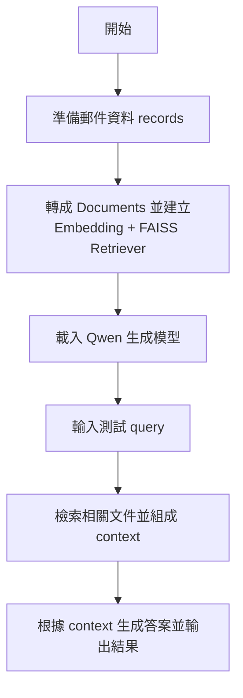

# hw6.py Flowchart

```mermaid
flowchart TD
    A[開始] --> B[準備郵件資料 records]
    B --> C[轉成 Documents 並建立<br/>Embedding + FAISS Retriever]
    C --> D[載入 Qwen 生成模型]
    D --> E[輸入測試 query]
    E --> F[檢索相關文件並組成 context]
    F --> G[根據 context 生成答案並輸出結果]
```
